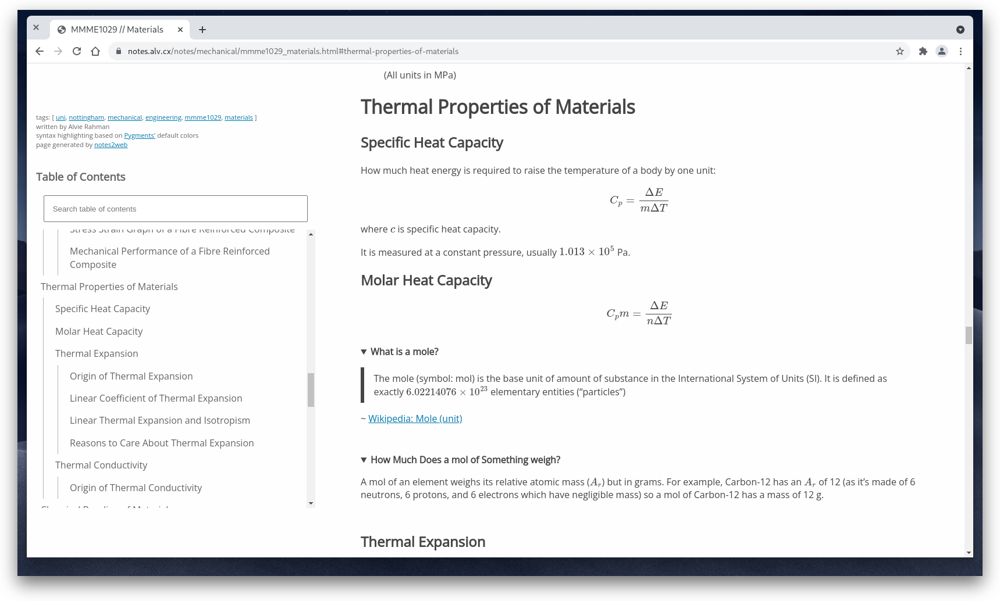

# notes2web

View your notes as a static html site. Browse a live sample of it [here](https://notes.alv.cx).




## Why?

I want to be able to view my notes in a more convenient way.
I was already writing them in Pandoc markdown and could view them as PDFs but that wasn't quite
doing it for me:

- It was inconvenient to flick through multiple files of notes to find the right PDF
- It was annoying to sync to my phone
- PDFs do not scale so they were hard to read on smaller screens
- Probably more reasons I can't think of right now
- Fun


## Install

0. Install [Pandoc](https://pandoc.org/index.html) and [Pip](https://github.com/pypa/pip)

   On arch:
   ```
   # pacman -S pandoc python-pip
   ```

1. Run `make install` as root

## Things to Remember Whilst Writing Notes

- notes2web reads the following YAML [frontmatter](https://jekyllrb.com/docs/front-matter/) variable:

  - `author` --- The person(s) who wrote the article
  - `tags` --- A YAML list of tags which the article relates to - this is used for browsing and also
               searching
  - `title` --- The title of the article
        
- notes2web indexes [ATX-style headings](https://pandoc.org/MANUAL.html#atx-style-headings) for
  searching
- notes2web attempts to display file history through the `git log` command

## CLI Usage

```
$ notes2web.py notes_directory
```

Output of `notes2web.py --help`:

```
usage: notes2web.py [-h] [-o OUTPUT_DIR] [-t TEMPLATE] [-H TEMPLATE_TEXT_HEAD]
                    [-f TEMPLATE_TEXT_FOOT] [-i TEMPLATE_INDEX_HEAD]
                    [-I TEMPLATE_INDEX_FOOT] [-s STYLESHEET]
                    [--home_index HOME_INDEX] [-e EXTRA_INDEX_CONTENT]
                    [-n INDEX_ARTICLE_NAMES] [-F] [--fuse FUSE]
                    [--searchjs SEARCHJS]
                    notes

positional arguments:
  notes

optional arguments:
  -h, --help            show this help message and exit
  -o OUTPUT_DIR, --output-dir OUTPUT_DIR
  -t TEMPLATE, --template TEMPLATE
  -H TEMPLATE_TEXT_HEAD, --template-text-head TEMPLATE_TEXT_HEAD
  -f TEMPLATE_TEXT_FOOT, --template-text-foot TEMPLATE_TEXT_FOOT
  -i TEMPLATE_INDEX_HEAD, --template-index-head TEMPLATE_INDEX_HEAD
  -I TEMPLATE_INDEX_FOOT, --template-index-foot TEMPLATE_INDEX_FOOT
  -s STYLESHEET, --stylesheet STYLESHEET
  --home_index HOME_INDEX
  -e EXTRA_INDEX_CONTENT, --extra-index-content EXTRA_INDEX_CONTENT
  -n INDEX_ARTICLE_NAMES, --index-article-names INDEX_ARTICLE_NAMES
  -F, --force           Generate new output html even if source file was
                        modified before output html
  --fuse FUSE
  --searchjs SEARCHJS
```

The command will generate a website in the `output-dir` directory (`./web` by default).
It will then generate a list of all note files and put it in `index.html`.

Then you just have to point a webserver at `output-dir`.

## Uninstall

```
# make uninstall
```
